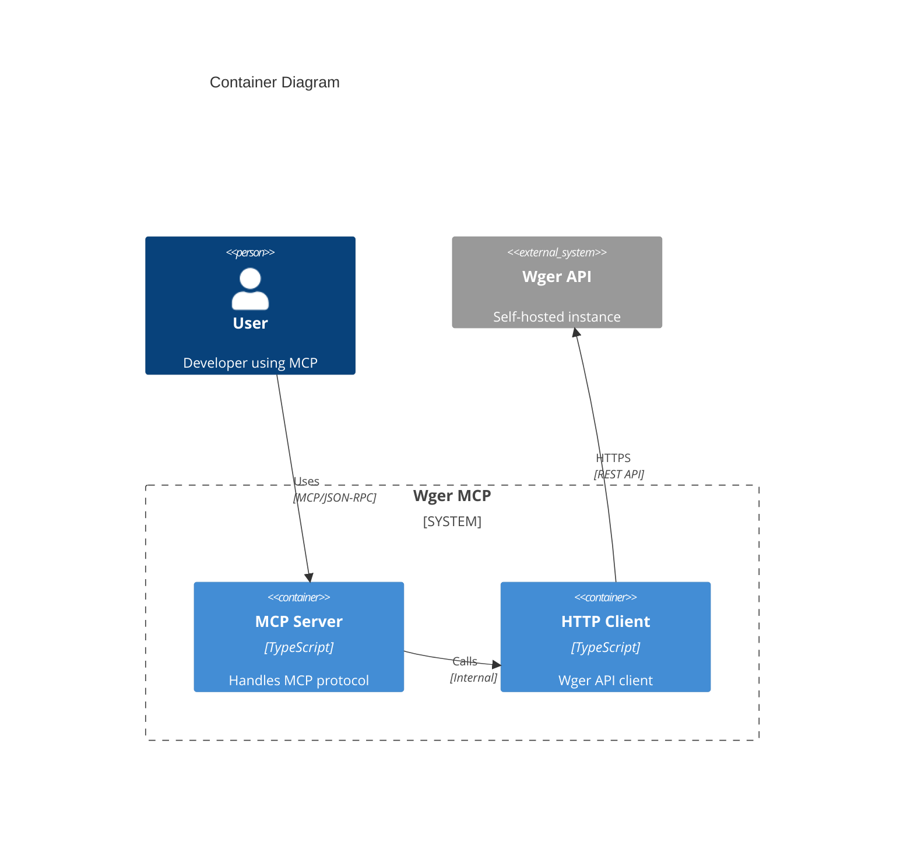
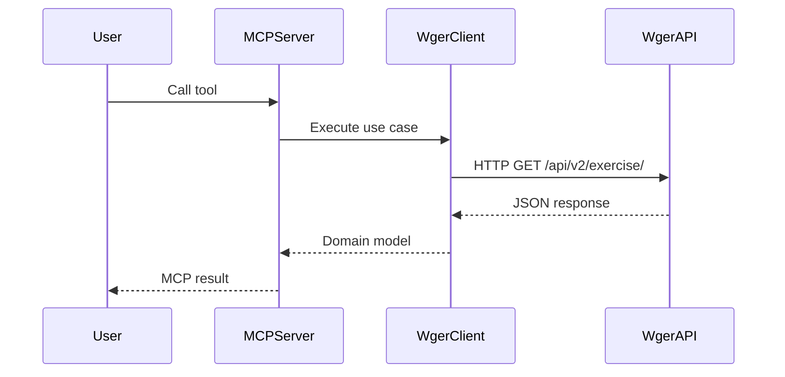
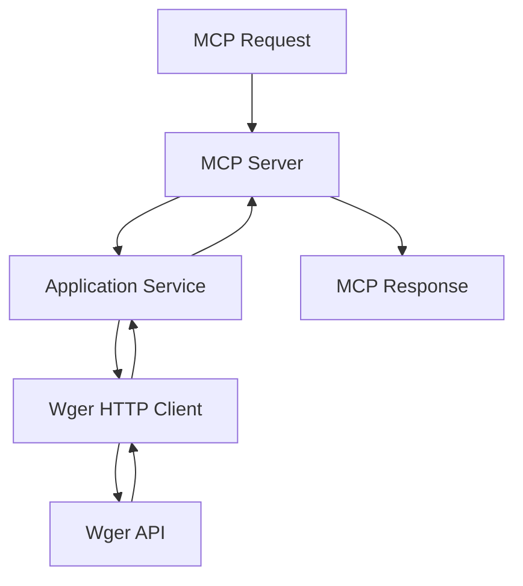

# Mermaid Patterns

## C4Container

```mermaid
C4Container
    title Container Diagram

    Person(user, "User", "Developer using MCP")
    System_Boundary(mcp, "Wger MCP") {
        Container(server, "MCP Server", "TypeScript", "Handles MCP protocol")
        Container(client, "HTTP Client", "TypeScript", "Wger API client")
    }
    System_Ext(wger, "Wger API", "Self-hosted instance")

    Rel(user, server, "Uses", "MCP/JSON-RPC")
    Rel(server, client, "Calls", "Internal")
    Rel(client, wger, "HTTPS", "REST API")
```

## Sequence Diagram

```mermaid
sequenceDiagram
    participant User
    participant MCPServer
    participant WgerClient
    participant WgerAPI

    User->>MCPServer: Call tool
    MCPServer->>WgerClient: Execute use case
    WgerClient->>WgerAPI: HTTP GET /api/v2/exercise/
    WgerAPI-->>WgerClient: JSON response
    WgerClient-->>MCPServer: Domain model
    MCPServer-->>User: MCP result
```

## Data Flow

```mermaid
graph TD
    A[MCP Request] --> B[MCP Server]
    B --> C[Application Service]
    C --> D[Wger HTTP Client]
    D --> E[Wger API]
    E --> D
    D --> C
    C --> B
    B --> F[MCP Response]
```
